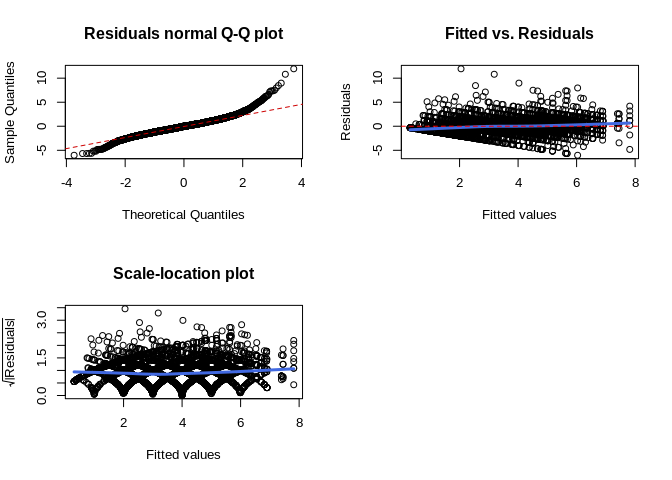
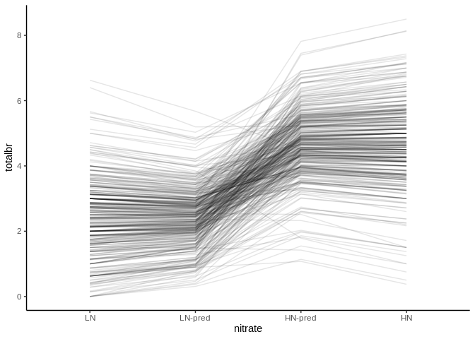
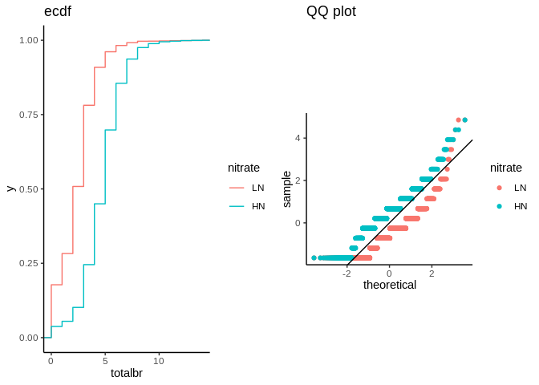
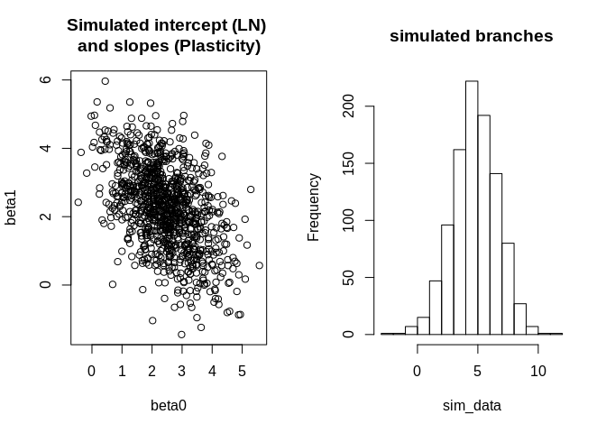
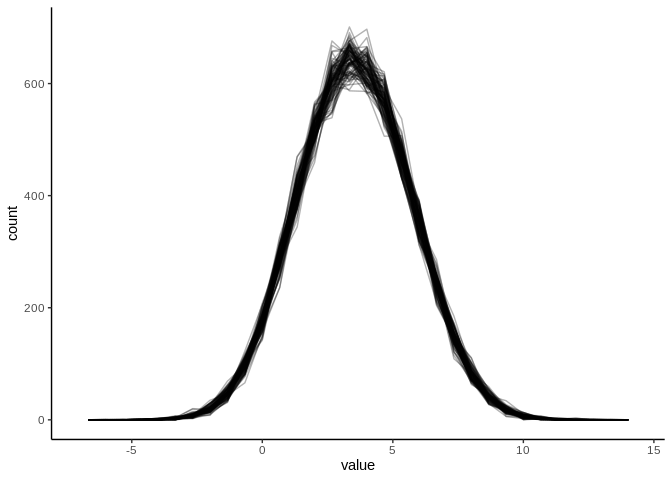

Fitting linear mixed models for trait data
==========================================

This document summarises and discusses the procedures used to fit linear
mixed models to our phenotypic data.

These models were used to estimate the proportion of genetic variance
that is attributed to plasticity (GxE) as well as to produce estimates
of heritability.

We use linear mixed models to explore the following questions:

-   is there significant plasticity for a trait in relation to nitrate?
-   is there significant *variation* in that plasticity between lines
    (GxE)?

Our definition of "plasticity" is simply the difference between the mean
trait values on `HN - LN`.

We present the model fitting routine for shoot branching, but the
procedure is then similar for the other traits.

    # Load packages
    library(tidyverse)
    library(lme4)
    library(broom)
    library(patchwork)

    # Change ggplot2 default aesthetics
    theme_set(theme_classic())

    # Source some custom functions
    source("../scripts/R/functions/plotLmmDiag.R")
    source("../scripts/R/functions/extractVarsLmm.R")

Read data
---------

There are two main datasets: accessions and MAGIC lines.

Here, we load both the individual-based data and the data summarised by
line (with plasticities calculated):

    # Read MAGIC line data
    magic_ind <- read_rds("../data_processed/phenotypes/magic_individual.rds")
    magic_plas <- read_rds("../data_processed/phenotypes/magic_plasticity.rds")

    # Read Accession data (note there is also senescence data for this set)
    acc_ind <- read_rds("../data_processed/phenotypes/accessions_individual_silique.rds")
    acc_plas <- read_rds("../data_processed/phenotypes/accessions_plasticity_silique.rds")

    acc_ind_sen <- read_rds("../data_processed/phenotypes/accessions_individual_senescence.rds")
    acc_plas_sen <- read_rds("../data_processed/phenotypes/accessions_plasticity_senescence.rds")

    # For modeling purposes, set the variable nitrate as a factor, with LN as the reference value
    magic_ind$nitrate <- factor(magic_ind$nitrate, levels = c("LN", "HN"))
    acc_ind$nitrate <- factor(acc_ind$nitrate, levels = c("LN", "HN"))
    acc_ind_sen$nitrate <- factor(acc_ind_sen$nitrate, levels = c("LN", "HN"))

GxE models - MAGIC lines
------------------------

We aim to fit the following model:

*Y* = *β*0 + *β*1 \* *N**I**T**R**A**T**E* + *u*0*j* + *u*1*j* + *ϵ**i**j*

Where *u*0*j*, *u*1*j*, *ϵ**i**j* are
all random terms for intercept, slopes and residuals, respectively.

The model is fit with `lme4` package assuming gaussian likelihood.

### Shoot branching

We start with the full GxE model, which is effectively a random slopes
model:

    totalbr_lmm <- lmer(totalbr ~ 1 + nitrate + (1 + nitrate|id_kover), data = magic_ind)
    summary(totalbr_lmm)

    ## Linear mixed model fit by REML ['lmerMod']
    ## Formula: totalbr ~ 1 + nitrate + (1 + nitrate | id_kover)
    ##    Data: magic_ind
    ## 
    ## REML criterion at convergence: 20566.2
    ## 
    ## Scaled residuals: 
    ##     Min      1Q  Median      3Q     Max 
    ## -4.0960 -0.5596 -0.0105  0.4932  8.1110 
    ## 
    ## Random effects:
    ##  Groups   Name        Variance Std.Dev. Corr 
    ##  id_kover (Intercept) 1.056    1.028         
    ##           nitrateHN   1.606    1.267    -0.52
    ##  Residual             2.171    1.473         
    ## Number of obs: 5370, groups:  id_kover, 374
    ## 
    ## Fixed effects:
    ##             Estimate Std. Error t value
    ## (Intercept)  2.42091    0.06049   40.02
    ## nitrateHN    2.25601    0.07707   29.27
    ## 
    ## Correlation of Fixed Effects:
    ##           (Intr)
    ## nitrateHN -0.564

From this model we can see that there is an overal positive effect of
nitrate, which we expect from the reaction norm plots (most genotypes
increase their branch number on HN). However, there is substantial
variation in this response, which can be seem from the proportion of
variance for the respective term (`nitrateHN`) in the random part of the
model.

The model diagnostics show some issues with the residuals, because shoot
branching is a discrete (count) variable:

    plotLmmDiag(totalbr_lmm)

Despite this, apart from the tails, the residuals are not far from
normal, and the scale-location plot doesn't show huge biases in variance
along the fitted values. (see section below for more considerations on
keeping with gaussian likelihood)

Due to these issues, we just quickly see what the model predictions are
compared with the observed data.

    model_pred <- coef(totalbr_lmm)$id_kover %>% 
      mutate(id_kover = rownames(.),
             nitrateHN = `(Intercept)` + nitrateHN) %>% 
      gather("nitrate", "totalbr", 1:2) %>% 
      mutate(nitrate = ifelse(nitrate == "(Intercept)", "LN-pred", "HN-pred"))

    obs_data <- magic_ind %>% 
      drop_na(totalbr) %>% 
      group_by(id_kover, nitrate) %>% 
      summarise(totalbr = mean(totalbr))

    bind_rows(model_pred, obs_data) %>% 
      mutate(nitrate = factor(nitrate, levels = c("LN", "LN-pred", "HN-pred", "HN"))) %>% 
      ggplot(aes(nitrate, totalbr, group = id_kover)) +
      geom_line(alpha = 0.1)

    ## Warning in bind_rows_(x, .id): binding character and factor vector,
    ## coercing into character vector

Basically, the model prediction is consistent with the averages
calculated directly from the data. The model didn't predict negative
values for branches (which is good), and all we see is a slight
shrinkage of predicted averages, which is characteristic of LMMs.

We thus assumed that our model, albeit imperfect, is a good enough
approximation of the data to allow making inferences about genetic and
non-genetic sources of variation.

#### Notes on the choice of likelihood function

Given that shoot branching is on a count scale, we need to consider what
likelihood function should be used to model it. A *poisson* would be an
obvious choice, although it might not be suitable as will be shown
below.

First, we look at the distribution of the trait, which is obviously not
normal:

    p1 <- magic_ind %>% 
      ggplot(aes(totalbr, colour = nitrate)) +
      stat_ecdf() + ggtitle("ecdf")

    p2 <- magic_ind %>% 
      ggplot(aes(sample = scale(totalbr), colour = nitrate)) +
      stat_qq() + geom_abline() + coord_fixed() + ggtitle("QQ plot")

    p1 + p2

From the QQ plot it is not too far out from normal though, it mostly
suffers from problems at the tails (truncated at zero and a bit of a
long upper tail).

If we were to use a poisson, we would be making a big assumption about
the variance of the trait, and that is that its variance should scale
with the mean (since mean and variance are the same for a Poisson). We
can quickly check that this is not the case:

    p1 <- magic_ind %>% 
      drop_na(totalbr) %>% 
      group_by(nitrate, id_kover) %>% 
      summarise(mean = mean(totalbr), var = var(totalbr)) %>% 
      ggplot(aes(mean, var, colour = nitrate)) +
      geom_point() + geom_abline()

    p2 <- magic_ind %>% 
      drop_na(totalbr) %>% 
      group_by(nitrate, id_kover) %>% 
      summarise(mean = mean(totalbr), dispersion = var(totalbr)/mean(totalbr)) %>% 
      ggplot(aes(mean, dispersion, colour = nitrate)) +
      geom_point() +
      geom_hline(yintercept = 1)

    p1 + p2

    ## Warning: Removed 6 rows containing missing values (geom_point).

This is far from the case. For a poisson, the coefficient of dispersions
is expected to be 1. There is some relationship between mean and
variance, in that the variance is lower at the lower end of values. So
whilst they do not seem fully independent, a poisson would not be
adequate in this case.

To further understand how the specified model is "seeing the world", we
simulate average responses using the model's estimates, to see what
would be "possible" according to the model:

    nsim <- 1000

    # Get residual sd
    res_sd <- VarCorr(totalbr_lmm) %>% as.data.frame() %>% slice(4) %>% pull(vcov) %>% sqrt()

    # Get variance-covariance matrix from random terms 
    vcov <- VarCorr(totalbr_lmm) %>% as.data.frame() %>% slice(1:3) %>% pull(vcov)
    vcov <- matrix(c(vcov[1], vcov[3], vcov[3], vcov[2]), ncol = 2)

    # Simulate from a multivariate normal distribution 
    rand <- MASS::mvrnorm(nsim, mu = c(0, 0), Sigma = vcov)

    # Define intercept (beta0) and slopes (beta1) with added random variation
    beta0 <- fixef(totalbr_lmm)[1] + rand[, 1]
    beta1 <- fixef(totalbr_lmm)[2] + rand[, 2]

    # Finally simulate new data using the residual variance
    sim_data <- rnorm(nsim, mean = beta0 + beta1, sd = res_sd)

    par(mfrow = c(1, 2))
    plot(beta0, beta1, main = "Simulated intercept (LN) \nand slopes (Plasticity)")
    hist(sim_data, main = "simulated branches")

We can also use the `simulate` function to get new responses:

    simulate(totalbr_lmm, nsim = 100) %>% 
      gather("rep", "value") %>% 
      ggplot(aes(value, group = rep)) + geom_freqpoly(alpha = 0.3)

    ## `stat_bin()` using `bins = 30`. Pick better value with `binwidth`.

We can see that the model predicts some negative branches, which is not
good. So, our model is definitely imperfect in this regard. Even though
our predictions did not fall on this negative space, it is good to be
aware of these limitations.

### Notes on future improvement

In the future it might be better to choose different likelihood
function.

For example, a negative binomial might help address the mean-variance
relationship, while still accounting for the data being on discrete
scale. I cannot immediately see how we could partition variance in that
case.

Also, using a bayesian approach might help, to try and keep the
parameter estimates reasonable (although this is probably more relevant
for estimates of individual genotypes, which only have ~8 reps; for
variance estimates we probably have so much data that the likelihood
will dominate over any vague prior we might use).
